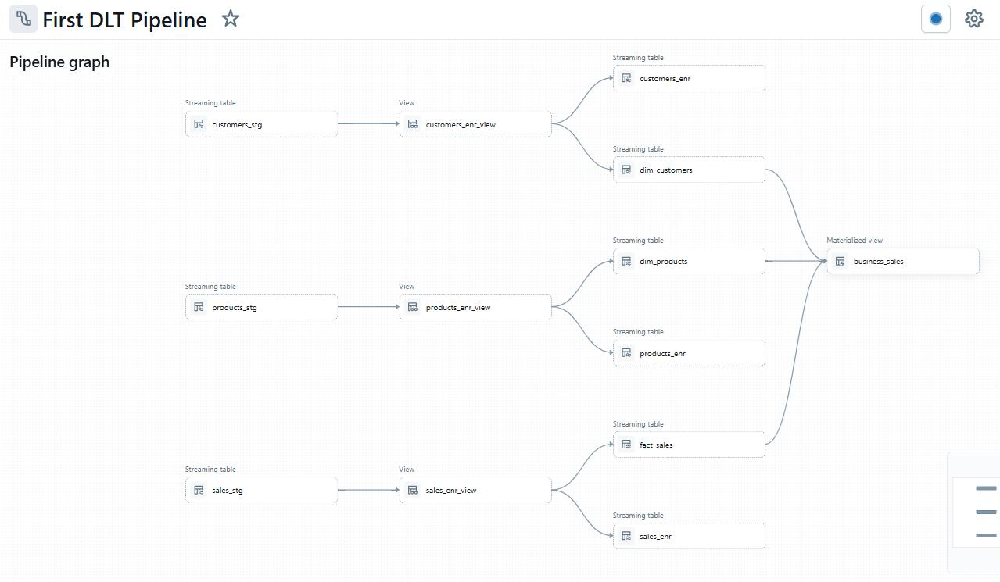

# 🏗️ Sales Data Declarative Pipeline - Databricks Delta Live Tables

**Declarative ETL pipeline built with Databricks DLT following Medallion Architecture**



## 🎯 What This Does

Transforms raw sales data from multiple regions into a production-ready data warehouse with:
- **Automated data quality** checks
- **Change data capture** (SCD Type 1 & 2)
- **Incremental processing** 
- **Historical tracking** of dimension changes

## 🏛️ Architecture

```
Raw Data → Bronze (Ingest) → Silver (Clean) → Gold (Analytics)
```

- **Bronze**: Raw data ingestion with basic validation
- **Silver**: Cleaned, enriched data with upserts
- **Gold**: Dimensional model ready for BI tools

## 📂 Project Structure

```
source_code/
├── bronze/     # Raw data ingestion
├── silver/     # Data cleaning & enrichment  
└── gold/       # Dimensional model & business views
```

## 🚀 Quick Start

1. **Setup Databricks workspace** (Free tier works)
2. **Enable Lakeflow pipeline editor** in Settings > Developer
3. **Create catalog**: `dlt` with schema `source`
4. **Load source data** (sales_east, sales_west, products, customers)
5. **Create DLT pipeline** and upload code files
6. **Run pipeline** - that's it!

## 💡 Key Features

- **Zero-config CDC**: Automatic handling of inserts, updates, deletes
- **Data quality gates**: Bad data stopped at source
- **Smart incremental loads**: Only processes what changed
- **SCD Type 2**: Full history preserved automatically
- **One-click deployment**: Declarative approach = less code

## 📊 Sample Output

After running, you'll have:
- `dim_products` & `dim_customers` (with full history)
- `fact_sales` (optimized for queries)  
- `business_view_sales` (ready for dashboards)

## 🔧 Technologies

- Databricks Delta Live Tables
- PySpark
- Delta Lake
- Medallion Architecture

---

*Built following [YouTube tutorial](https://www.youtube.com/watch?v=CCc6w8lkAek) on modern data engineering with Databricks*
